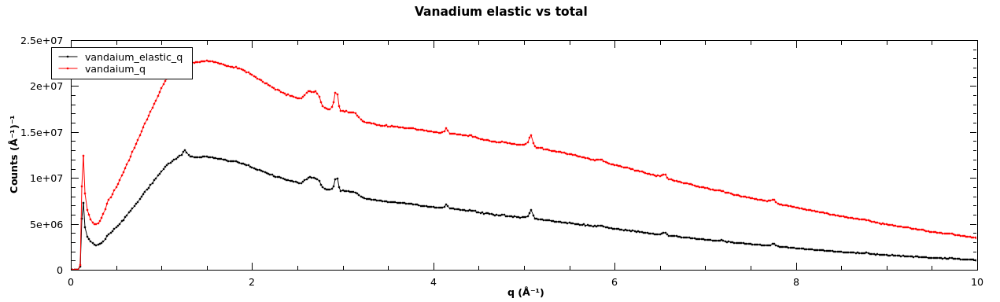
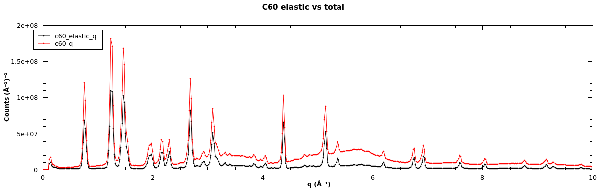
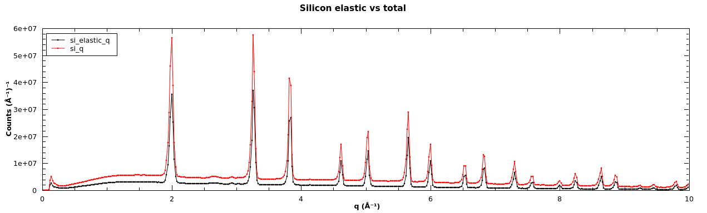

# Cross-correlation to extract elastic signal

For detail on the cross-correlation method on see [Corelli: Efficient
single crystal diffraction with elastic
discrimination](https://doi.org/10.1007/s12043-008-0259-x)

The method is implemented in Mantid with [CorelliCrossCorrelate]

The correlation chopper is most often set to 293.4118Hz

## Powder examples

### Vanadium

```python
# Load the data
vanadium=Load('CORELLI_47400')
# Calculate elastic vanadiumgnal
vanadium_elastic=CorelliCrossCorrelate(vanadium,TimingOffset=56000)

# Convert to q, rebin and sum all the spectra
vanadium_q=ConvertUnits(vanadium,Target="MomentumTransfer",EMode="Elastic")
Rebin(InputWorkspace='vanadium_q', OutputWorkspace='vanadium_q', Params='0.01,0.02,10',PreserveEvents=0)
SumSpectra(InputWorkspace='vanadium_q', OutputWorkspace='vanadium_q')

# Same for the elastic signal
vanadium_elastic_q=ConvertUnits(vanadium_elastic,Target="MomentumTransfer",EMode="Elastic")
Rebin(InputWorkspace='vanadium_elastic_q', OutputWorkspace='vanadium_elastic_q', Params='0.01,0.02,10',PreserveEvents=0)
SumSpectra(InputWorkspace='vanadium_elastic_q', OutputWorkspace='vanadium_elastic_q')

# Plot the results
p=plotSpectrum(('vanadium_q','vanadium_elastic_q'),0)
p.activeLayer().setTitle("Vanadium elastic vs total")
p.exportImage('vanadium_elastic_vs_total.png',50)
```


### C60

```python
# Load the data
c60=Load('CORELLI_47367')
# Calculate elastic signal
c60_elastic=CorelliCrossCorrelate(c60,TimingOffset=56000)

# Convert to q, rebin and sum all the spectra
c60_q=ConvertUnits(c60,Target="MomentumTransfer",EMode="Elastic")
Rebin(InputWorkspace='c60_q', OutputWorkspace='c60_q', Params='0.01,0.02,10',PreserveEvents=0)
SumSpectra(InputWorkspace='c60_q', OutputWorkspace='c60_q')

# Same for the elastic signal
c60_elastic_q=ConvertUnits(c60_elastic,Target="MomentumTransfer",EMode="Elastic")
Rebin(InputWorkspace='c60_elastic_q', OutputWorkspace='c60_elastic_q', Params='0.01,0.02,10',PreserveEvents=0)
SumSpectra(InputWorkspace='c60_elastic_q', OutputWorkspace='c60_elastic_q')

# Plot the results
p=plotSpectrum(('c60_q','c60_elastic_q'),0)
p.activeLayer().setTitle("C60 elastic vs total")
p.exportImage('c60_elastic_vs_total.png',50)
```


### Silicon

```python
# Load the data
si=Load('CORELLI_47335')
# Calculate elastic signal
si_elastic=CorelliCrossCorrelate(si,TimingOffset=56000)

# Convert to q, rebin and sum all the spectra
si_q=ConvertUnits(si,Target="MomentumTransfer",EMode="Elastic")
Rebin(InputWorkspace='si_q', OutputWorkspace='si_q', Params='0.01,0.02,10',PreserveEvents=0)
SumSpectra(InputWorkspace='si_q', OutputWorkspace='si_q')

# Same for the elastic signal
si_elastic_q=ConvertUnits(si_elastic,Target="MomentumTransfer",EMode="Elastic")
Rebin(InputWorkspace='si_elastic_q', OutputWorkspace='si_elastic_q', Params='0.01,0.02,10',PreserveEvents=0)
SumSpectra(InputWorkspace='si_elastic_q', OutputWorkspace='si_elastic_q')

# Plot the results
p=plotSpectrum(('si_q','si_elastic_q'),0)
p.activeLayer().setTitle("Silicon elastic vs total")
p.exportImage('si_elastic_vs_total.png',50)
```


## Auto-reduction

Auto-reduction automatically calculates the elastic signal for
you. You can find the files at
`/SNS/CORELLI/IPTS-<number>/shared/autoreduce/CORELLI_<run>_elastic.nxs`

## Timing Offset

The timing offset is the time between the Top Dead Center (TDC) of the
correlation chopper passing the sensors and the TDC signal actaully
being recorded.

* * *
#### Next: [Converting to MD](md)
#### Up: [Index](index)

[CorelliCrossCorrelate]: http://docs.mantidproject.org/nightly/algorithms/CorelliCrossCorrelate.html
