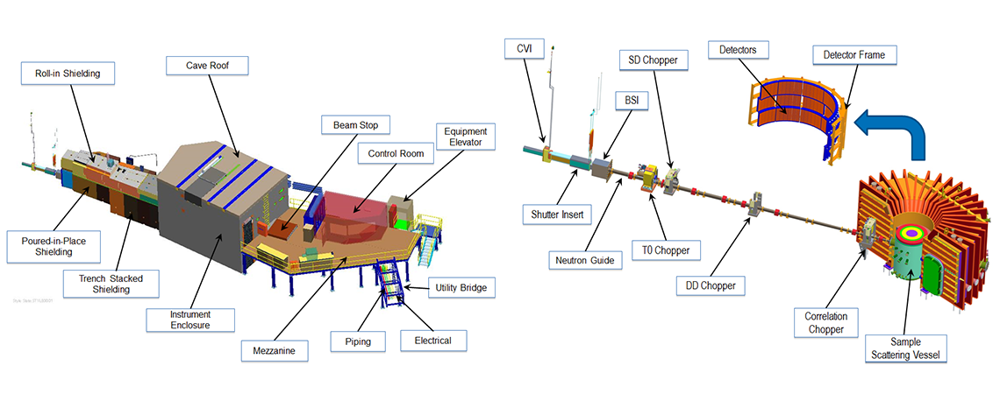

# CORELLI | BL-9 | SNS   Elastic Diffuse Scattering Spectrometer

Information about Corelli can be found [here](https://neutrons.ornl.gov/corelli)

Live data collection information can be found [here](https://monitor.sns.gov/dasmon/corelli)

## Visual Overview of the CORELLI Instrument

## Single Crystal Diffuse Scattering Reduction

The data reduction for Corelli is done using [Mantid](http://www.mantidproject.org)

### Contents:
* [Elastic scattering using cross-correlation](cc)
* [Converting to MD](md)
* [Finding Peaks](peaks)
* [Finding the UB Matrix](ub)
* [Normalisation and symmetry](reduction)
* [Creating Solid Angle and Flux workpace](van)
* Complete examples:
  * [Benzil](benzil)
