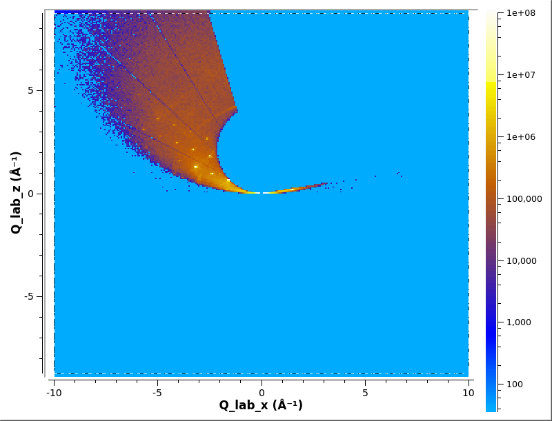
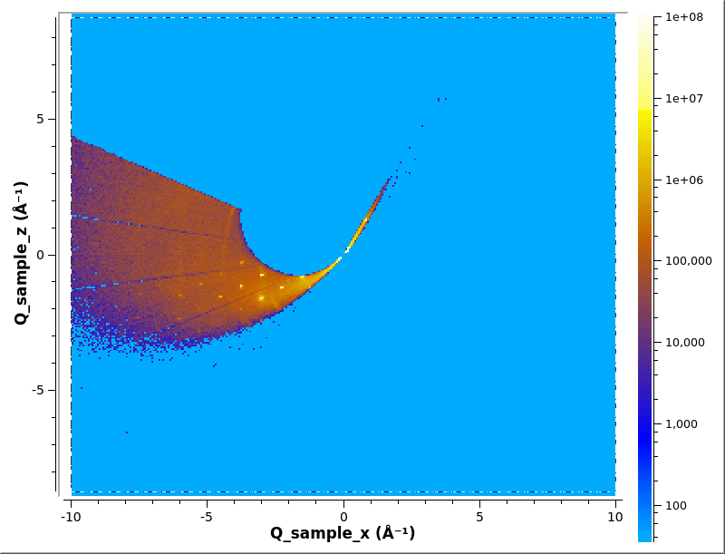
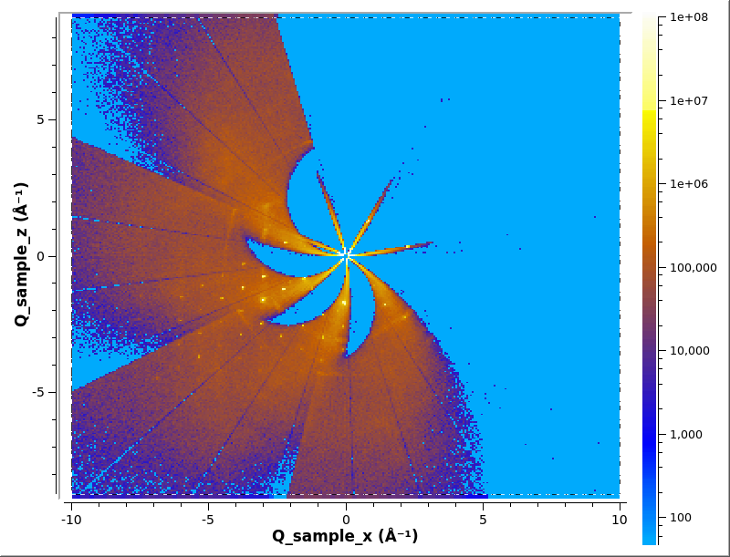
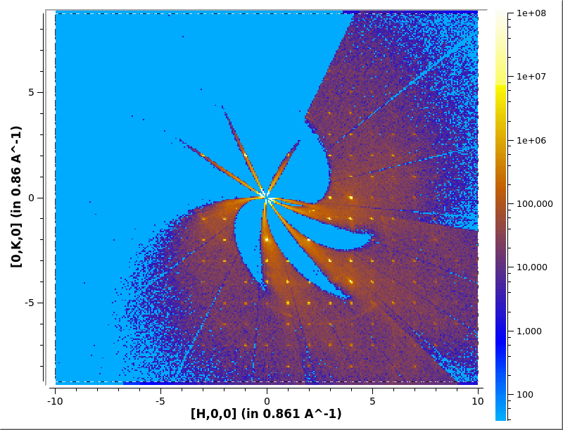

# Converting to multi-dimensional (MD) workspace

A MD workspace comes in two types, a [MDWorkspace] which contains
event data and [MDHistoWorkspace] which is histogram data.

For mantid training on MD workspaces see [MDWorkspaces] and
[MDVisualisation]. For a complete list of algorithms to work with MD
workspaces see [MDAlgorithms].

### Contents:
* [Q lab](#q-lab)
* [Q sample](#q-sample)
* [HKL](#hkl)
* [Multiple files](#multiple-files)
  * [Q sample](#q-sample-1)
  * [HKL](#hkl-1)
* [Slicing](#slicing)
* [Histogramming](#histogramming)

A single file can be converted to a MDWorkspace using [ConvertToMD].

## Q lab

[Load] some data
```python
ws=Load('CORELLI_29792')
```

Then convert to MD workspace using [ConvertToMD].

```python
ConvertToMD(InputWorkspace='ws',
            QDimensions='Q3D',
            dEAnalysisMode='Elastic',
            Q3DFrames='Q_lab',
            OutputWorkspace='md',
            MinValues='-10,-10,-10',
            MaxValues='10,10,10')

# Plot in Slice Viewer
sv=plotSlice('md',xydim=('Q_lab_x','Q_lab_z'),colormax=1e8,limits=[-10,10,-10,10],colorscalelog=True)
sv.setRebinMode(True)
sv.setRebinNumBins(300,300)
sv.saveImage('md_lab.png')
```



## Q sample

In order to convert it to Q sample you need to specify which
goniometer to use with [SetGoniometer]. This will depend on what
sample enviroment you are using.

```python
SetGoniometer(ws, Axis0="BL9:Mot:Sample:Axis1,0,1,0,1")
```

Then convert to MD workspace using [ConvertToMD].

```python
ConvertToMD(InputWorkspace='ws',
            QDimensions='Q3D',
            dEAnalysisMode='Elastic',
            Q3DFrames='Q_sample',
            OutputWorkspace='md',
            MinValues='-10,-10,-10',
            MaxValues='10,10,10')

# Plot in Slice Viewer
sv=plotSlice('md',xydim=('Q_sample_x','Q_sample_z'),colormax=1e8,limits=[-10,10,-10,10],colorscalelog=True)
sv.setRebinMode(True)
sv.setRebinNumBins(300,300)
sv.saveImage('md_sample.png')
```



## HKL

In order to convert to HKL space you will need to find the UB Matrix
first, see [Finding the UB Matrix](ub). We will load the UB from file
using [LoadIsawUB] then Convert to MD.

```python
# Load UB
LoadIsawUB(ws, Filename='benzil.mat')

# Conver to MD
ConvertToMD(InputWorkspace='ws',
            QDimensions='Q3D',
            dEAnalysisMode='Elastic',
            Q3DFrames='HKL',
            QConversionScales='HKL,
            OutputWorkspace='md',
            MinValues='-10,-10,-10',
            MaxValues='10,10,10')

# Plot in Slice Viewer
sv=plotSlice('md',xydim=('[H,0,0]','[0,K,0]'),colormax=1e8,limits=[-10,10,-10,10],colorscalelog=True)
sv.setRebinMode(True)
sv.setRebinNumBins(300,300)
sv.saveImage('md_hkl.png')
```


# Multiple files

A series of MD Workspaces can be combined with [MergeMD].

## Q sample

```python
runs=range(29782,29817,10)

for r in runs:
    data=Load('CORELLI_{}'.format(r))
    SetGoniometer(data,Axis0='BL9:Mot:Sample:Axis1,0,1,0,1')
    ConvertToMD(data,QDimensions='Q3D',DEanalysisMode='Elastic',Q3DFrames='Q_sample',
                OutputWorkspace='md_{}'.format(r),
                MinValues='-10,-10,-10',MaxValues='10,10,10')
md=MergeMD(','.join(['md_{}'.format(r) for r in runs]))
```

The workflow algorithm [ConvertMultipleRunsToSingleCrystalMD] will
load the data, convert to MD, and merges the results for you. This
produces the same results as above.

```python
ConvertMultipleRunsToSingleCrystalMD(Filename='CORELLI_29782:29817:10',
                                     SetGoniometer=True,
                                     Axis0="BL9:Mot:Sample:Axis1,0,1,0,1",
                                     MinValues='-10,-10,-10',
                                     MaxValues='10,10,10',
                                     OutputWorkspace='md')

# Plot in Slice Viewer
sv=plotSlice('md',xydim=('Q_sample_x','Q_sample_z'),colormax=1e8,limits=[-10,10,-10,10],colorscalelog=True)
sv.setRebinMode(True)
sv.setRebinNumBins(300,300)
sv.saveImage('md.png')
```



## HKL

If you provide [ConvertMultipleRunsToSingleCrystalMD] with an UB
Matrix if will produced a MDWorkspace in HKL.

```python
ConvertMultipleRunsToSingleCrystalMD(Filename='CORELLI_29782:29817:10',
                                     SetGoniometer=True,
                                     Axis0="BL9:Mot:Sample:Axis1,0,1,0,1",
                                     UBMatrix='benzil.mat',
                                     MinValues='-10,-10,-10',
                                     MaxValues='10,10,10',
                                     OutputWorkspace='md')

# Plot in Slice Viewer
sv=plotSlice('md',xydim=('[H,0,0]','[0,K,0]'),colormax=1e8,limits=[-10,10,-10,10],colorscalelog=True)
sv.setRebinMode(True)
sv.setRebinNumBins(300,300)
sv.saveImage('md2.png')
```



# Slicing

An MDEventWorkspace can be sliced using the following:
* [SliceMD]
* [CutMD]


# Histogramming

Everything until now has been working with event data in
MDEventWorkspaces. You can convert the event data to histogram
(MDEventWorkspace to a MDHistoWorkpsace) using [BinMD].

A MDHistoWorkpsace can be sliced using [SliceMDHisto],
[IntegrateMDHistoWorkspace] or [ProjectMD].

* * *
#### Previous: [Elastic scattering using cross-correlation](cc) &nbsp;&nbsp;&nbsp;&nbsp;&nbsp;&nbsp; Next: [Finding Peaks](peaks)
#### Up: [Index](index)


[MDWorkspace]: http://docs.mantidproject.org/nightly/concepts/MDWorkspace.html
[MDHistoWorkspace]: http://docs.mantidproject.org/nightly/concepts/MDHistoWorkspace.html
[ConvertToMD]: http://docs.mantidproject.org/nightly/algorithms/ConvertToMD.html
[Load]: http://docs.mantidproject.org/nightly/algorithms/Load.html
[SetGoniometer]: http://docs.mantidproject.org/nightly/algorithms/SetGoniometer.html
[LoadIsawUB]: http://docs.mantidproject.org/nightly/algorithms/LoadIsawUB.html
[MergeMD]: http://docs.mantidproject.org/nightly/algorithms/MergeMD.html
[ConvertMultipleRunsToSingleCrystalMD]: http://docs.mantidproject.org/nightly/algorithms/ConvertMultipleRunsToSingleCrystalMD.html
[SliceMD]: http://docs.mantidproject.org/nightly/algorithms/SliceMD.html
[CutMD]: http://docs.mantidproject.org/nightly/algorithms/CutMD.html
[SliceMDHisto]: http://docs.mantidproject.org/nightly/algorithms/SliceMDHisto.html
[IntegrateMDHistoWorkspace]: http://docs.mantidproject.org/nightly/algorithms/IntegrateMDHistoWorkspace.html
[ProjectMD]: http://docs.mantidproject.org/nightly/algorithms/ProjectMD.html
[BinMD]: http://docs.mantidproject.org/nightly/algorithms/BinMD.html
[MDWorkspaces]: http://www.mantidproject.org/MBC_MDWorkspaces
[MDVisualisation]: http://www.mantidproject.org/MBC_MDVisualisation
[MDAlgorithms]: http://docs.mantidproject.org/nightly/algorithms/categories/MDAlgorithms.html
