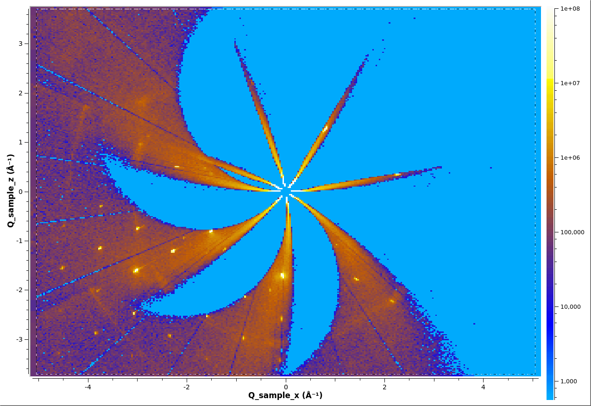

# Converting to multi-dimensional (MD) workspace

A MD workspace comes in two types, a
[MDWorkspace](http://docs.mantidproject.org/nightly/concepts/MDWorkspace.html)
which contains event data and
[MDHistoWorkspace](http://docs.mantidproject.org/nightly/concepts/MDHistoWorkspace.html)
which is histogram data.

## Q sample

A single file can be converted to a MDWorkspace using
[ConvertToMD](http://docs.mantidproject.org/nightly/algorithms/ConvertToMD.html). A
series of MD Workspaces can be combined with
[MergeMD](http://docs.mantidproject.org/nightly/algorithms/MergeMD.html).


The workflow algorithm
[ConvertMultipleRunsToSingleCrystalMD](http://docs.mantidproject.org/nightly/algorithms/ConvertMultipleRunsToSingleCrystalMD.html)
will load the data, convert to MD, and merges the results for you.

```python
ConvertMultipleRunsToSingleCrystalMD(Filename='CORELLI_29782:29817:10',
                                     FilterByTofMin=1000,
                                     FilterByTofMax=16666,
                                     SetGoniometer=True,
                                     Axis0="BL9:Mot:Sample:Axis1,0,1,0,1",
                                     OutputWorkspace='md')

# Plot in Slice Viewer
sv=plotSlice('md',xydim=('Q_sample_x','Q_sample_z'),colormax=1e8,limits=[-5,5,-5,5],colorscalelog=True)
sv.setRebinMode(True)
sv.setRebinNumBins(300,300)
sv.saveImage('md.png')
```



## HKL

In order to convert to HKL space you will need to find the UB Matrix
first, see [Finding the UB Matrix](ub.md).