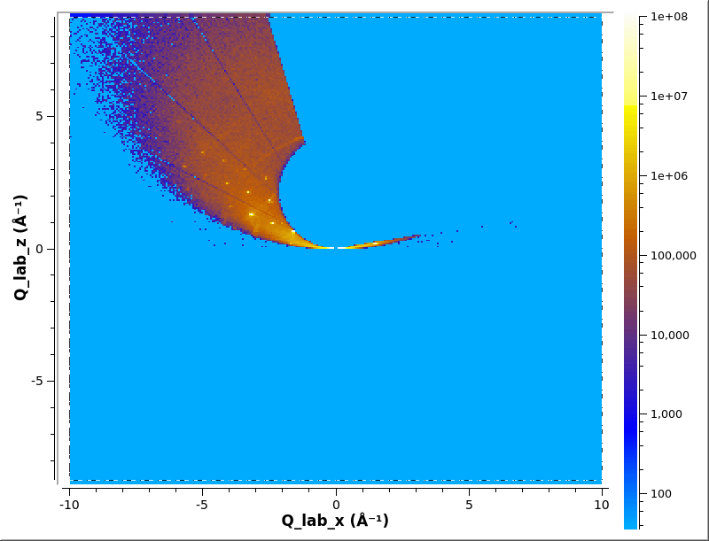
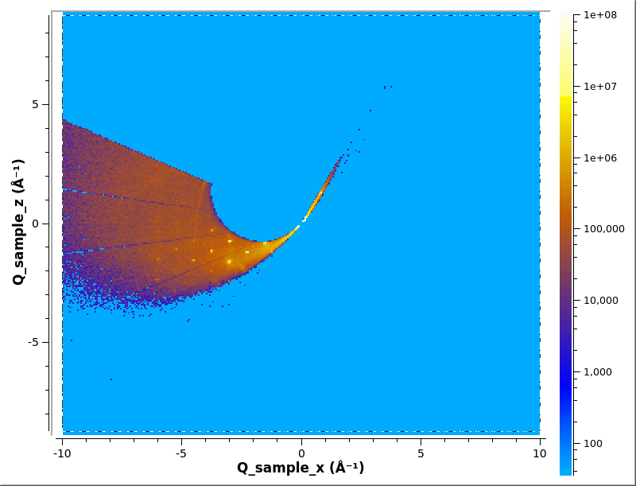
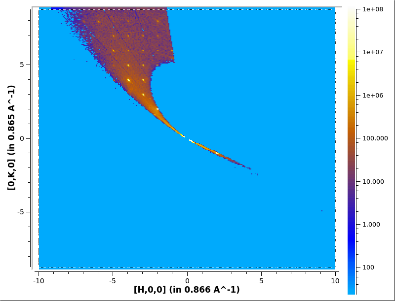

# Converting to multi-dimensional (MD) workspace

A MD workspace comes in two types, a
[MDWorkspace](http://docs.mantidproject.org/nightly/concepts/MDWorkspace.html)
which contains event data and
[MDHistoWorkspace](http://docs.mantidproject.org/nightly/concepts/MDHistoWorkspace.html)
which is histogram data.

For mantid training on MD workspaces see
[MDWorkspaces](http://www.mantidproject.org/MBC_MDWorkspaces) and
[MDVisualisation](http://www.mantidproject.org/MBC_MDVisualisation).


### Contents:
* [Q lab](#q-lab)
* [Q sample](#q-sample)
* [HKL](#hkl)
* [Multiple files](#multiple-files)
  * [Q sample](#q-sample-multi)
  * [HKL](#hkl-multi)

A single file can be converted to a MDWorkspace using
[ConvertToMD](http://docs.mantidproject.org/nightly/algorithms/ConvertToMD.html).

## Q lab

```python
# Load some data
ws=Load('CORELLI_29792')
```

Then convert to MD workspace using
[ConvertToMD](http://docs.mantidproject.org/nightly/algorithms/ConvertToMD.html).

```python
ConvertToMD(InputWorkspace='ws',
            QDimensions='Q3D',
	    dEAnalysisMode='Elastic',
	    Q3DFrames='Q_lab',
	    OutputWorkspace='md',
	    MinValues='-10,-10,-10',
	    MaxValues='10,10,10')
# Plot in Slice Viewer
sv=plotSlice('md',xydim=('Q_lab_x','Q_lab_z'),colormax=1e8,limits=[-5,5,-5,5],colorscalelog=True)
sv.setRebinMode(True)
sv.setRebinNumBins(300,300)
sv.saveImage('md_lab.png')
```



## Q sample


In order to comvert it too Q sample you need to specify which
goniometer to use with
[SetGoniometer](http://docs.mantidproject.org/nightly/algorithms/SetGoniometer.html). This
will depend on what sample enviroment you are using.

```python
SetGoniometer(ws, Axis0="BL9:Mot:Sample:Axis1,0,1,0,1")
```

Then convert to MD workspace using
[ConvertToMD](http://docs.mantidproject.org/nightly/algorithms/ConvertToMD.html).

```python
ConvertToMD(InputWorkspace='ws',
            QDimensions='Q3D',
	    dEAnalysisMode='Elastic',
	    Q3DFrames='Q_sample',
	    OutputWorkspace='md',
	    MinValues='-10,-10,-10',
	    MaxValues='10,10,10')
# Plot in Slice Viewer
sv=plotSlice('md',xydim=('Q_sample_x','Q_sample_z'),colormax=1e8,limits=[-5,5,-5,5],colorscalelog=True)
sv.setRebinMode(True)
sv.setRebinNumBins(300,300)
sv.saveImage('md_sample.png')
```



```python
SetGoniometer(ws, Axis0="BL9:Mot:Sample:Axis1,0,1,0,1")
```

Then convert to MD workspace using
[ConvertToMD](http://docs.mantidproject.org/nightly/algorithms/ConvertToMD.html).

```python
ConvertToMD(InputWorkspace='ws',
            QDimensions='Q3D',
	    dEAnalysisMode='Elastic',
	    Q3DFrames='Q_sample',
	    OutputWorkspace='md',
	    MinValues='-10,-10,-10',
	    MaxValues='10,10,10')
# Plot in Slice Viewer
sv=plotSlice('md',xydim=('Q_sample_x','Q_sample_z'),colormax=1e8,limits=[-5,5,-5,5],colorscalelog=True)
sv.setRebinMode(True)
sv.setRebinNumBins(300,300)
sv.saveImage('md_sample.png')
```

## HKL

In order to convert to HKL space you will need to find the UB Matrix
first, see [Finding the UB Matrix](ub.md). We will load the UB from
file using
[LoadIsawUB](http://docs.mantidproject.org/nightly/algorithms/LoadIsawUB.html)
then Convert to MD.

```python
# Load UB
LoadIsawUB(ws, Filename='benzil.mat')
Conver tot MD
ConvertToMD(InputWorkspace='ws',
            QDimensions='Q3D',
	    dEAnalysisMode='Elastic',
	    Q3DFrames='Q_sample',
	    OutputWorkspace='md',
	    MinValues='-10,-10,-10',
	    MaxValues='10,10,10')
# Plot in Slice Viewer
sv=plotSlice('md',xydim=('[H,0,0]','[0,K,0]'),colormax=1e8,limits=[-5,5,-5,5],colorscalelog=True)
sv.setRebinMode(True)
sv.setRebinNumBins(300,300)
sv.saveImage('md_hkl.png')
```




# Multiple files

A series of MD Workspaces can be combined with
[MergeMD](http://docs.mantidproject.org/nightly/algorithms/MergeMD.html).

The workflow algorithm
[ConvertMultipleRunsToSingleCrystalMD](http://docs.mantidproject.org/nightly/algorithms/ConvertMultipleRunsToSingleCrystalMD.html)
will load the data, convert to MD, and merges the results for you.

```python
ConvertMultipleRunsToSingleCrystalMD(Filename='CORELLI_29782:29817:10',
                                     FilterByTofMin=1000,
                                     FilterByTofMax=16666,
                                     SetGoniometer=True,
                                     Axis0="BL9:Mot:Sample:Axis1,0,1,0,1",
                                     OutputWorkspace='md')

# Plot in Slice Viewer
sv=plotSlice('md',xydim=('Q_sample_x','Q_sample_z'),colormax=1e8,limits=[-5,5,-5,5],colorscalelog=True)
sv.setRebinMode(True)
sv.setRebinNumBins(300,300)
sv.saveImage('md_hkl.png')
```


