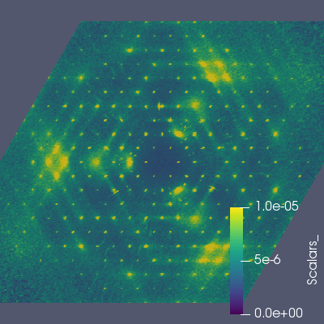

# Paraview

> [ParaView](https://www.paraview.org) is an open-source, multi-platform
> data analysis and visualization application. ParaView users can
> quickly build visualizations to analyze their data using qualitative
> and quantitative techniques. The data exploration can be done
> interactively in 3D or programmatically using ParaView’s batch
> processing capabilities.
>
> ParaView was developed to analyze extremely large datasets using
> distributed memory computing resources. It can be run on
> supercomputers to analyze datasets of petascale size as well as on
> laptops for smaller data, has become an integral tool in many national
> laboratories, universities and industry, and has won several awards
> related to high performance computation.

To use paraview first save the data as a VTK file, see
[here](export#vtk). The following scripts can be run from ParaView
(_Tools->Python Shell->Run Script_) or by running in `pvpython`.

## Slices

```python
#### import the simple module from the paraview
from paraview.simple import *

# create a new 'XML Structured Grid Reader'
benzilvts = XMLStructuredGridReader(FileName=['benzil.vts'])

# get active view
renderView1 = GetActiveViewOrCreate('RenderView')

# uncomment following to set a specific view size
renderView1.ViewSize = [400, 400]

#change interaction mode for render view
renderView1.InteractionMode = '2D'

# Properties modified on renderView1
renderView1.OrientationAxesVisibility = 0

# create a new 'Slice'
slice1 = Slice(Input=benzilvts)
slice1.SliceType.Normal = [0.0, 0.0, 1.0]

# get color transfer function/color map for 'Scalars_'
scalars_LUT = GetColorTransferFunction('Scalars_')

# show data in view
slice1Display = Show(slice1, renderView1)

# show color bar/color legend
slice1Display.SetScalarBarVisibility(renderView1, True)

# Rescale transfer function
scalars_LUT.RescaleTransferFunction(0.0, 1e-05)

# Apply a preset using its name. Note this may not work as expected when presets have duplicate names.
scalars_LUT.ApplyPreset('Viridis (matplotlib)', True)

# current camera placement for renderView1
renderView1.CameraParallelScale = 10

#### uncomment the following to render all views
# RenderAllViews()
# alternatively, if you want to write images, you can use SaveScreenshot(...).

SaveScreenshot('benzil_hk0.png', quality=100, view=renderView1)
```


### HK1

```python
slice1.SliceType.Origin = [0.0, 0.0, 1.0]
SaveScreenshot('benzil_hk1.png', quality=100, view=renderView1)
```



### HK4

```python
slice1.SliceType.Origin = [0.0, 0.0, 4.0]
SaveScreenshot('benzil_hk4.png', quality=100, view=renderView1)
```


### Animation

```python
# hide color bar/color legend
slice1Display.SetScalarBarVisibility(renderView1, False)

# get animation scene
animationScene1 = GetAnimationScene()

# Properties modified on animationScene1
animationScene1.NumberOfFrames = 100

# get animation track
track = GetAnimationTrack('Origin', index=2, proxy=slice1.SliceType)

# create keyframes for this animation track

# create a key frame
startKeyFrame = CompositeKeyFrame()
startKeyFrame.KeyValues = [-4]

# create a key frame
endKeyFrame = CompositeKeyFrame()
endKeyFrame.KeyTime = 1.0
endKeyFrame.KeyValues = [4]

# initialize the animation track
track.KeyFrames = [startKeyFrame, endKeyFrame]

# save animation
SaveAnimation('/tmp/benzil.png', renderView1, ImageResolution=[200, 200],
    TransparentBackground=1,
    FrameWindow=[0, 99])
```

A series of images are created that you can them convert to an animated gif, _e.g._ using `ffmpeg`:
```shell
$ ffmpeg -i /tmp/benzil.%04d.png benzil.gif
```


## Multiple slices

### Mn2O3 showing 0KL, H1L and HK2

```python
#### import the simple module from the paraview
from paraview.simple import *

# create a new 'XML Structured Grid Reader'
mn2O3_elasticvts = XMLStructuredGridReader(FileName=['Mn2O3_elastic.vts'])

# get active view
renderView1 = GetActiveViewOrCreate('RenderView')

# uncomment following to set a specific view size
renderView1.ViewSize = [400, 400]

# Properties modified on renderView1
renderView1.OrientationAxesVisibility = 0

# create a new 'Slice'
slice1 = Slice(Input=mn2O3_elasticvts)
slice1.SliceType.Normal = [1.0, 0.0, 0.0]

# create a new 'Slice'
slice2 = Slice(Input=mn2O3_elasticvts)
slice2.SliceType.Normal	= [0.0, 1.0, 0.0]
slice2.SliceType.Origin = [0.0, 1.0, 0.0]

# create a new 'Slice'
slice3 = Slice(Input=mn2O3_elasticvts)
slice3.SliceType.Normal = [0.0, 0.0, 1.0]
slice3.SliceType.Origin = [0.0, 0.0, 2.0]

# get color transfer function/color map for 'Scalars_'
scalars_LUT = GetColorTransferFunction('Scalars_')

# show data in view
slice1Display = Show(slice1, renderView1)
slice2Display = Show(slice2, renderView1)
slice3Display = Show(slice3, renderView1)

# Rescale transfer function
scalars_LUT.RescaleTransferFunction(0.0, 3e-05)

# Apply a preset using its name. Note this may not work as expected when presets have duplicate names.
scalars_LUT.ApplyPreset('Viridis (matplotlib)', True)

renderView1.CameraPosition = [-14, -14, -14]

#### uncomment the following to render all views
# RenderAllViews()
# alternatively, if you want to write images, you can use SaveScreenshot(...).

SaveScreenshot('Mn2O3_multiSlice.png', quality=100, view=renderView1)
```


### CZO showing 0KL, H1L and HK2

```python
#### import the simple module from the paraview
from paraview.simple import *

# create a new 'XML Structured Grid Reader'
CZOvts = XMLStructuredGridReader(FileName=['CZO.vts'])

# get active view
renderView1 = GetActiveViewOrCreate('RenderView')

# uncomment following to set a specific view size
renderView1.ViewSize = [400, 400]

# Properties modified on renderView1
renderView1.OrientationAxesVisibility = 0

# create a new 'Slice'
slice1 = Slice(Input=CZOvts)
slice1.SliceType.Normal = [1.0, 0.0, 0.0]

# create a new 'Slice'
slice2 = Slice(Input=CZOvts)
slice2.SliceType.Normal	= [0.0, 1.0, 0.0]
slice2.SliceType.Origin = [0.0, 1.0, 0.0]

# create a new 'Slice'
slice3 = Slice(Input=CZOvts)
slice3.SliceType.Normal = [0.0, 0.0, 1.0]
slice3.SliceType.Origin = [0.0, 0.0, 2.0]

# get color transfer function/color map for 'Scalars_'
scalars_LUT = GetColorTransferFunction('Scalars_')

# show data in view
slice1Display = Show(slice1, renderView1)
slice2Display = Show(slice2, renderView1)
slice3Display = Show(slice3, renderView1)

# Rescale transfer function
scalars_LUT.RescaleTransferFunction(0.0, 8e-05)

# Apply a preset using its name. Note this may not work as expected when presets have duplicate names.
scalars_LUT.ApplyPreset('Viridis (matplotlib)', True)

renderView1.CameraPosition = [-14, -14, -14]

#### uncomment the following to render all views
# RenderAllViews()
# alternatively, if you want to write images, you can use SaveScreenshot(...).

SaveScreenshot('CZO_multiSlice.png', quality=100, view=renderView1)
```


## Surface

## Volume


* * *
#### Previous: [Matplotlib](matplotlib)        Next: [Benzil](benzil)
#### Up: [Index](index)
