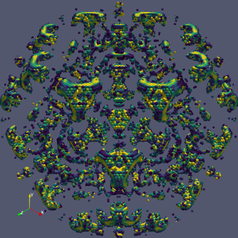
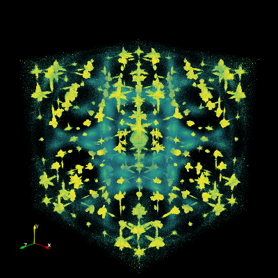
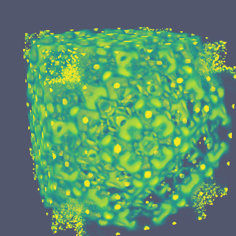

# Paraview

> [ParaView](https://www.paraview.org) is an open-source, multi-platform
> data analysis and visualization application. ParaView users can
> quickly build visualizations to analyze their data using qualitative
> and quantitative techniques. The data exploration can be done
> interactively in 3D or programmatically using ParaView’s batch
> processing capabilities.
>
> ParaView was developed to analyze extremely large datasets using
> distributed memory computing resources. It can be run on
> supercomputers to analyze datasets of petascale size as well as on
> laptops for smaller data, has become an integral tool in many national
> laboratories, universities and industry, and has won several awards
> related to high performance computation.

To use paraview first save the data as a VTK file, see
[here](export#vtk). The following scripts can be run from ParaView
(_Tools->Python Shell->Run Script_) or by running in `pvpython`.

## Converting to Image Data

By converting the data to Image data performace, particularly for
[volume rendering](#volume), can be greatly improved.

```python
#### import the simple module from the paraview
from paraview.simple import *

# create a new 'XML Structured Grid Reader'
mn2O3_elastic_35vts = XMLStructuredGridReader(FileName=['Mn2O3_elastic_3.5.vts'])

# create a new 'Resample To Image'
resampleToImage1 = ResampleToImage(Input=mn2O3_elastic_35vts)
resampleToImage1.SamplingDimensions = [351, 351, 351]

SaveData('Mn2O3_elastic_3.5.vti', proxy=resampleToImage1)
```

## Slices

```python
#### import the simple module from the paraview
from paraview.simple import *

# create a new 'XML Structured Grid Reader'
benzilvts = XMLStructuredGridReader(FileName=['benzil.vts'])

# get active view
renderView1 = GetActiveViewOrCreate('RenderView')

# uncomment following to set a specific view size
renderView1.ViewSize = [400, 400]

#change interaction mode for render view
renderView1.InteractionMode = '2D'

# Properties modified on renderView1
renderView1.OrientationAxesVisibility = 0

# create a new 'Slice'
slice1 = Slice(Input=benzilvts)
slice1.SliceType.Normal = [0.0, 0.0, 1.0]

# get color transfer function/color map for 'Scalars_'
scalars_LUT = GetColorTransferFunction('Scalars_')

# show data in view
slice1Display = Show(slice1, renderView1)

# show color bar/color legend
slice1Display.SetScalarBarVisibility(renderView1, True)

# Rescale transfer function
scalars_LUT.RescaleTransferFunction(0.0, 1e-05)

# Apply a preset using its name. Note this may not work as expected when presets have duplicate names.
scalars_LUT.ApplyPreset('Viridis (matplotlib)', True)

# current camera placement for renderView1
renderView1.CameraParallelScale = 10

#### uncomment the following to render all views
# RenderAllViews()
# alternatively, if you want to write images, you can use SaveScreenshot(...).

SaveScreenshot('benzil_hk0.png', quality=100, view=renderView1)
```


### HK1

```python
slice1.SliceType.Origin = [0.0, 0.0, 1.0]
SaveScreenshot('benzil_hk1.png', quality=100, view=renderView1)
```


### HK4

```python
slice1.SliceType.Origin = [0.0, 0.0, 4.0]
SaveScreenshot('benzil_hk4.png', quality=100, view=renderView1)
```


### Animate Origin

```python
# hide color bar/color legend
slice1Display.SetScalarBarVisibility(renderView1, False)

# get animation scene
animationScene1 = GetAnimationScene()

# Properties modified on animationScene1
animationScene1.NumberOfFrames = 100

# get animation track
track = GetAnimationTrack('Origin', index=2, proxy=slice1.SliceType)

# create keyframes for this animation track

# create a key frame
startKeyFrame = CompositeKeyFrame()
startKeyFrame.KeyValues = [-4]

# create a key frame
endKeyFrame = CompositeKeyFrame()
endKeyFrame.KeyTime = 1.0
endKeyFrame.KeyValues = [4]

# initialize the animation track
track.KeyFrames = [startKeyFrame, endKeyFrame]

# save animation
SaveAnimation('/tmp/benzil.png', renderView1, ImageResolution=[200, 200],
    TransparentBackground=1,
    FrameWindow=[0, 99])
```

A series of images are created that you can them convert to an animated gif, _e.g._ using `ffmpeg`:
```shell
$ ffmpeg -i /tmp/benzil.%04d.png benzil.gif
```


## Multiple slices

### Mn2O3 showing 0KL, H1L and HK2

```python
#### import the simple module from the paraview
from paraview.simple import *

# create a new 'XML Structured Grid Reader'
mn2O3_elasticvts = XMLStructuredGridReader(FileName=['Mn2O3_elastic.vts'])

# get active view
renderView1 = GetActiveViewOrCreate('RenderView')

# uncomment following to set a specific view size
renderView1.ViewSize = [400, 400]

# Properties modified on renderView1
renderView1.OrientationAxesVisibility = 0

# create a new 'Slice'
slice1 = Slice(Input=mn2O3_elasticvts)
slice1.SliceType.Normal = [1.0, 0.0, 0.0]

# create a new 'Slice'
slice2 = Slice(Input=mn2O3_elasticvts)
slice2.SliceType.Normal	= [0.0, 1.0, 0.0]
slice2.SliceType.Origin = [0.0, 1.0, 0.0]

# create a new 'Slice'
slice3 = Slice(Input=mn2O3_elasticvts)
slice3.SliceType.Normal = [0.0, 0.0, 1.0]
slice3.SliceType.Origin = [0.0, 0.0, 2.0]

# get color transfer function/color map for 'Scalars_'
scalars_LUT = GetColorTransferFunction('Scalars_')

# show data in view
slice1Display = Show(slice1, renderView1)
slice2Display = Show(slice2, renderView1)
slice3Display = Show(slice3, renderView1)

# Rescale transfer function
scalars_LUT.RescaleTransferFunction(0.0, 3e-05)

# Apply a preset using its name. Note this may not work as expected when presets have duplicate names.
scalars_LUT.ApplyPreset('Viridis (matplotlib)', True)

renderView1.CameraPosition = [-14, -14, -14]

#### uncomment the following to render all views
# RenderAllViews()
# alternatively, if you want to write images, you can use SaveScreenshot(...).

SaveScreenshot('Mn2O3_multiSlice.png', quality=100, view=renderView1)
```


#### Animate Origin

```python
# get animation scene
animationScene1 = GetAnimationScene()

# Properties modified on animationScene1
animationScene1.NumberOfFrames = 50

# get animation track
track = GetAnimationTrack('Origin', index=2, proxy=slice3.SliceType)

# create keyframes for this animation track

# create a key frame
startKeyFrame = CompositeKeyFrame()
startKeyFrame.KeyValues = 1

# create a key frame
midKeyFrame = CompositeKeyFrame()
midKeyFrame.KeyTime = 0.5
midKeyFrame.KeyValues = 3

# create a key frame
endKeyFrame = CompositeKeyFrame()
endKeyFrame.KeyTime = 1.0
endKeyFrame.KeyValues = 1

# initialize the animation track
track.KeyFrames = [startKeyFrame, midKeyFrame, endKeyFrame]

# save animation
SaveAnimation('/tmp/Mn2O3_multiSlice.png', renderView1, ImageResolution=[200, 200], FrameWindow=[0, 49])
```

A series of images are created that you can them convert to an animated gif, _e.g._ using `ffmpeg`:
```shell
$ ffmpeg -r 10 -i /tmp/Mn2O3_multiSlice.%04d.png Mn2O3_multiSlice.gif
```


### CZO showing 0KL, H1L and HK2

```python
#### import the simple module from the paraview
from paraview.simple import *

# create a new 'XML Structured Grid Reader'
CZOvts = XMLStructuredGridReader(FileName=['CZO.vts'])

# get active view
renderView1 = GetActiveViewOrCreate('RenderView')

# uncomment following to set a specific view size
renderView1.ViewSize = [400, 400]

# Properties modified on renderView1
renderView1.OrientationAxesVisibility = 0

# create a new 'Slice'
slice1 = Slice(Input=CZOvts)
slice1.SliceType.Normal = [1.0, 0.0, 0.0]

# create a new 'Slice'
slice2 = Slice(Input=CZOvts)
slice2.SliceType.Normal	= [0.0, 1.0, 0.0]
slice2.SliceType.Origin = [0.0, 1.0, 0.0]

# create a new 'Slice'
slice3 = Slice(Input=CZOvts)
slice3.SliceType.Normal = [0.0, 0.0, 1.0]
slice3.SliceType.Origin = [0.0, 0.0, 2.0]

# get color transfer function/color map for 'Scalars_'
scalars_LUT = GetColorTransferFunction('Scalars_')

# show data in view
slice1Display = Show(slice1, renderView1)
slice2Display = Show(slice2, renderView1)
slice3Display = Show(slice3, renderView1)

# Rescale transfer function
scalars_LUT.RescaleTransferFunction(0.0, 8e-05)

# Apply a preset using its name. Note this may not work as expected when presets have duplicate names.
scalars_LUT.ApplyPreset('Viridis (matplotlib)', True)

renderView1.CameraPosition = [-25, -25, -25]

#### uncomment the following to render all views
# RenderAllViews()
# alternatively, if you want to write images, you can use SaveScreenshot(...).

SaveScreenshot('CZO_multiSlice.png', quality=100, view=renderView1)
```


#### Animate Visibility

```python
# get animation scene
animationScene1 = GetAnimationScene()

# Properties modified on animationScene1
animationScene1.NumberOfFrames = 11

# get animation track
slice1track = GetAnimationTrack('Visibility', proxy=slice1)

# create keyframes for this animation track

# create a key frame
keyFrame1_0 = CompositeKeyFrame()
keyFrame1_0.KeyValues = 0
keyFrame1_0.Interpolation = 'Boolean'

# create a key frame
keyFrame1_1 = CompositeKeyFrame()
keyFrame1_1.KeyTime = 0.1
keyFrame1_1.KeyValues = 1
keyFrame1_1.Interpolation = 'Boolean'

# create a key frame
keyFrame1_2 = CompositeKeyFrame()
keyFrame1_2.KeyTime = 0.9
keyFrame1_2.KeyValues = 0
keyFrame1_2.Interpolation = 'Boolean'

# initialize the animation track
slice1track.KeyFrames = [keyFrame1_0, keyFrame1_1, keyFrame1_2]

# get animation track
slice2track = GetAnimationTrack('Visibility', proxy=slice2)

# create keyframes for this animation track

# create a key frame
keyFrame2_0 = CompositeKeyFrame()
keyFrame2_0.KeyValues = 0
keyFrame2_0.Interpolation = 'Boolean'

# create a key frame
keyFrame2_1 = CompositeKeyFrame()
keyFrame2_1.KeyTime = 0.2
keyFrame2_1.KeyValues = 1
keyFrame2_1.Interpolation = 'Boolean'

# create a key frame
keyFrame2_2 = CompositeKeyFrame()
keyFrame2_2.KeyTime = 0.8
keyFrame2_2.KeyValues = 0
keyFrame2_2.Interpolation = 'Boolean'

# initialize the animation track
slice2track.KeyFrames = [keyFrame2_0, keyFrame2_1, keyFrame2_2]

# get animation track
slice3track = GetAnimationTrack('Visibility', proxy=slice3)

# create keyframes for this animation track

# create a key frame
keyFrame3_0 = CompositeKeyFrame()
keyFrame3_0.KeyValues = 0
keyFrame3_0.Interpolation = 'Boolean'

# create a key frame
keyFrame3_1 = CompositeKeyFrame()
keyFrame3_1.KeyTime = 0.3
keyFrame3_1.KeyValues = 1
keyFrame3_1.Interpolation = 'Boolean'

# create a key frame
keyFrame3_2 = CompositeKeyFrame()
keyFrame3_2.KeyTime = 0.7
keyFrame3_2.KeyValues = 0
keyFrame3_2.Interpolation = 'Boolean'

# initialize the animation track
slice3track.KeyFrames = [keyFrame3_0, keyFrame3_1, keyFrame3_2]

# save animation
SaveAnimation('/tmp/CZO.png', renderView1, ImageResolution=[400, 400], FrameWindow=[0,10])
```

A series of images are created that you can them convert to an animated gif, _e.g._ using `ffmpeg`:
```shell
$ ffmpeg -r 4 -i /tmp/CZO.%04d.png CZO_multiSlice.gif
```


### Sphere

#### Animate radius while rotating camera

```python
#### import the simple module from the paraview
from paraview.simple import *

# create a new 'XML Structured Grid Reader'
CZOvts = XMLStructuredGridReader(FileName=['CZO.vts'])

# get active view
renderView1 = GetActiveViewOrCreate('RenderView')

# uncomment following to set a specific view size
renderView1.ViewSize = [400, 400]

# Properties modified on renderView1
renderView1.OrientationAxesVisibility = 0

# create a new 'Slice'
slice1 = Slice(Input=CZOvts)
slice1.SliceType = 'Sphere'
slice1.SliceType.Radius = 7.0

# get color transfer function/color map for 'Scalars_'
scalars_LUT = GetColorTransferFunction('Scalars_')

# show data in view
slice1Display = Show(slice1, renderView1)

# Rescale transfer function
scalars_LUT.RescaleTransferFunction(0.0, 8e-05)

# Apply a preset using its name. Note this may not work as expected when presets have duplicate names.
scalars_LUT.ApplyPreset('Viridis (matplotlib)', True)

# get animation scene
animationScene1 = GetAnimationScene()

# Properties modified on animationScene1
animationScene1.NumberOfFrames = 200

# get animation track
slice1SliceTypeRadiusTrack = GetAnimationTrack('Radius', index=0, proxy=slice1.SliceType)

# create a key frame
startKeyFrame = CompositeKeyFrame()
startKeyFrame.KeyTime = 0.0
startKeyFrame.KeyValues = 7.0

# create a key frame
midKeyFrame = CompositeKeyFrame()
midKeyFrame.KeyTime = 0.5
midKeyFrame.KeyValues = 3.0

# create a key frame
endKeyFrame = CompositeKeyFrame()
endKeyFrame.KeyTime = 1.0
endKeyFrame.KeyValues = 7.0

# initialize the animation track
slice1SliceTypeRadiusTrack.KeyFrames = [startKeyFrame, midKeyFrame, endKeyFrame]

cameraAnimationCue1 = GetCameraTrack(view=renderView1)

# create keyframes for this animation track

# create a key frame
keyFrame0 = CameraKeyFrame()
keyFrame0.Position = [0.0, 0.0, 30.74036927872979]
keyFrame0.ParallelScale = 1.73
keyFrame0.PositionPathPoints = [0.0, 0.0, 30.0, 23.31437884370913, 0.0, 18.879611731495125, 29.34442802201417, 0.0, -6.23735072453278, 13.619714992186408, 0.0, -26.730195725651036, -12.202099292274005, 0.0, -27.40636372927803, -28.97777478867205, 0.0, -7.7645713530756275, -24.27050983124843, 0.0, 17.633557568774194]
keyFrame0.FocalPathPoints = [0.0, 0.0, 0.0]
keyFrame0.ClosedPositionPath = 1

# create a key frame
keyFrame1 = CameraKeyFrame()
keyFrame1.KeyTime = 1.0
keyFrame1.Position = [0.0, 0.0, 30.74036927872979]
keyFrame1.ParallelScale = 1.73

# initialize the animation track
cameraAnimationCue1.Mode = 'Path-based'
cameraAnimationCue1.KeyFrames = [keyFrame0, keyFrame1]

# save animation
SaveAnimation('/tmp/CZO.png', renderView1, ImageResolution=[200, 200], FrameWindow=[0, 198])
```

A series of images are created that you can them convert to an animated gif, _e.g._ using `ffmpeg`:
```shell
$ ffmpeg -i /tmp/CZO.%04d.png CZO_sphere.gif
```


## Clipping

### Eighth

```python
#### import the simple module from the paraview
from paraview.simple import *

# create a new 'XML Structured Grid Reader'
mn2O3vts = XMLStructuredGridReader(FileName=['Mn2O3.vts'])

# get active view
renderView1 = GetActiveViewOrCreate('RenderView')

# uncomment following to set a specific view size
renderView1.ViewSize = [400, 400]

# Properties modified on renderView1
renderView1.OrientationAxesVisibility = 0

# create a new 'Clip'
clip1 = Clip(Input=mn2O3vts)
clip1.ClipType = 'Sphere'
clip1.InsideOut = 1
clip1.ClipType.Radius = 5.0

# create a new 'Clip'
clip2 = Clip(Input=clip1)
clip2.ClipType = 'Box'
clip2.ClipType.Position = [0, 0, 0]
clip2.ClipType.Scale = [5, 5, 5]

# get color transfer function/color map for 'Scalars_'
scalars_LUT = GetColorTransferFunction('Scalars_')

# show data in view
clip2Display = Show(clip2, renderView1)

# Rescale transfer function
scalars_LUT.RescaleTransferFunction(0.0, 5e-05)

# Apply a preset using its name. Note this may not work as expected when presets have duplicate names.
scalars_LUT.ApplyPreset('Viridis (matplotlib)', True)

renderView1.CameraPosition = [12, 12, 12]

#### uncomment the following to render all views
# RenderAllViews()
# alternatively, if you want to write images, you can use SaveScreenshot(...).

SaveScreenshot('Mn2O3_clipping.png', quality=100, view=renderView1)
```


#### Animate Opacity

```python
# get animation scene
animationScene1 = GetAnimationScene()

# Properties modified on animationScene1
animationScene1.NumberOfFrames = 50
    
# show data in view
clip1Display = Show(clip1, renderView1)

# Rescale transfer function
scalars_LUT.RescaleTransferFunction(0.0, 5e-05)

# get animation track
clip1track = GetAnimationTrack('Opacity', index=0, proxy=clip1)

# create keyframes for this animation track

# create a key frame
keyFrame0 = CompositeKeyFrame()
keyFrame0.KeyValues = 1

# create a key frame
keyFrame1 = CompositeKeyFrame()
keyFrame1.KeyTime = 0.25
keyFrame1.KeyValues = 0

# create a key frame
keyFrame2 = CompositeKeyFrame()
keyFrame2.KeyTime = 0.50
keyFrame2.KeyValues = 0

# create a key frame
keyFrame3 = CompositeKeyFrame()
keyFrame3.KeyTime = 0.75
keyFrame3.KeyValues = 1

# initialize the animation track
clip1track.KeyFrames = [keyFrame0, keyFrame1, keyFrame2, keyFrame3]

SaveAnimation('/tmp/Mn2O3_clipping.png', renderView1, ImageResolution=[200, 200], FrameWindow=[0, 49])
```

A series of images are created that you can them convert to an animated gif, e.g. using `ffmpeg`:

```shell
$ ffmpeg -i /tmp/Mn2O3_clipping.%04d.png Mn2O3_clipping.gif
```


### Pacman

```python
#### import the simple module from the paraview
from paraview.simple import *

# create a new 'XML Structured Grid Reader'
mn2O3vts = XMLStructuredGridReader(FileName=['CZO.vts'])

# get active view
renderView1 = GetActiveViewOrCreate('RenderView')

# uncomment following to set a specific view size
renderView1.ViewSize = [400, 400]

# Properties modified on renderView1
renderView1.OrientationAxesVisibility = 0

# create a new 'Clip'
clip1 = Clip(Input=mn2O3vts)
clip1.ClipType = 'Sphere'
clip1.InsideOut = 1
clip1.ClipType.Radius = 5.0

# create a new 'Clip'
clip2 = Clip(Input=clip1)
clip2.ClipType = 'Box'
clip2.ClipType.Position = [-5, 0, 0]
clip2.ClipType.Scale = [10, 5, 5]
clip2.ClipType.Rotation = [60, 0, 0]

# create a new 'Clip'
clip3 = Clip(Input=clip1)
clip3.ClipType = 'Box'
clip3.ClipType.Position = [-5, 0, 0]
clip3.ClipType.Scale = [10, 5, 5]
clip3.ClipType.Rotation  = [30, 0, 0]

# get color transfer function/color map for 'Scalars_'
scalars_LUT = GetColorTransferFunction('Scalars_')

# show data in view
clip2Display = Show(clip2, renderView1)

# show data in view
clip3Display = Show(clip3, renderView1)

# Rescale transfer function
scalars_LUT.RescaleTransferFunction(0.0, 1e-04)

# Apply a preset using its name. Note this may not work as expected when presets have duplicate names.
scalars_LUT.ApplyPreset('Viridis (matplotlib)', True)

renderView1.CameraPosition = [-20, 0, 0]

# get animation scene
animationScene1 = GetAnimationScene()

# Properties modified on animationScene1
animationScene1.NumberOfFrames = 100

# get animation track
clip2ClipTypeRotationTrack = GetAnimationTrack('Rotation', index=0, proxy=clip2.ClipType)

# create keyframes for this animation track

# create a key frame
keyFrame2_0 = CompositeKeyFrame()
keyFrame2_0.KeyValues = [45.0]
keyFrame2_1 = CompositeKeyFrame()
keyFrame2_1.KeyTime = 0.125
keyFrame2_1.KeyValues = [90.0]
keyFrame2_2 = CompositeKeyFrame()
keyFrame2_2.KeyTime = 0.25
keyFrame2_2.KeyValues = [45.0]
keyFrame2_3 = CompositeKeyFrame()
keyFrame2_3.KeyTime = 0.375
keyFrame2_3.KeyValues = [90.0]
keyFrame2_4 = CompositeKeyFrame()
keyFrame2_4.KeyTime = 0.5
keyFrame2_4.KeyValues = [45.0]
keyFrame2_5 = CompositeKeyFrame()
keyFrame2_5.KeyTime = 0.625
keyFrame2_5.KeyValues = [90.0]
keyFrame2_6 = CompositeKeyFrame()
keyFrame2_6.KeyTime = 0.75
keyFrame2_6.KeyValues = [45.0]
keyFrame2_7 = CompositeKeyFrame()
keyFrame2_7.KeyTime = 0.875
keyFrame2_7.KeyValues = [90.0]
keyFrame2_8 = CompositeKeyFrame()
keyFrame2_8.KeyTime = 1.0
keyFrame2_8.KeyValues = [45.0]

# initialize the animation track
clip2ClipTypeRotationTrack.KeyFrames = [keyFrame2_0, keyFrame2_1, keyFrame2_2, keyFrame2_3, keyFrame2_4, keyFrame2_5, keyFrame2_6, keyFrame2_7, keyFrame2_8]

# get animation track
clip3ClipTypeRotationTrack = GetAnimationTrack('Rotation', index=0, proxy=clip3.ClipType)

# create keyframes for this animation track

# create a key frame
keyFrame3_0 = CompositeKeyFrame()
keyFrame3_0.KeyValues = [45.0]
keyFrame3_1 = CompositeKeyFrame()
keyFrame3_1.KeyTime = 0.125
keyFrame3_1.KeyValues = [0.0]
keyFrame3_2 = CompositeKeyFrame()
keyFrame3_2.KeyTime = 0.25
keyFrame3_2.KeyValues = [45.0]
keyFrame3_3 = CompositeKeyFrame()
keyFrame3_3.KeyTime = 0.375
keyFrame3_3.KeyValues = [0.0]
keyFrame3_4 = CompositeKeyFrame()
keyFrame3_4.KeyTime = 0.5
keyFrame3_4.KeyValues = [45.0]
keyFrame3_5 = CompositeKeyFrame()
keyFrame3_5.KeyTime = 0.625
keyFrame3_5.KeyValues = [0.0]
keyFrame3_6 = CompositeKeyFrame()
keyFrame3_6.KeyTime = 0.75
keyFrame3_6.KeyValues = [45.0]
keyFrame3_7 = CompositeKeyFrame()
keyFrame3_7.KeyTime = 0.875
keyFrame3_7.KeyValues = [0.0]
keyFrame3_8 = CompositeKeyFrame()
keyFrame3_8.KeyTime = 1.0
keyFrame3_8.KeyValues = [45.0]

# initialize the animation track
clip3ClipTypeRotationTrack.KeyFrames = [keyFrame3_0, keyFrame3_1, keyFrame3_2, keyFrame3_3, keyFrame3_4, keyFrame3_5, keyFrame3_6, keyFrame3_7, keyFrame3_8]

# get camera animation track for the view
cameraAnimationCue1 = GetCameraTrack(view=renderView1)

# create keyframes for this animation track

# create a key frame
keyFrame4863 = CameraKeyFrame()
keyFrame4863.Position = [-20.0, 0.0, 0.0]
keyFrame4863.PositionPathPoints = [-25.0, 0.0, 34.0,
                                   -25.0, 0.0, -34.0]
keyFrame4863.FocalPathPoints = [0.0, 0.0, 34.0,
                                0.0, 0.0, -34.0]

# create a key frame
keyFrame4864 = CameraKeyFrame()
keyFrame4864.KeyTime = 1.0
keyFrame4864.Position = [-20.0, 0.0, 0.0]

# initialize the animation track
cameraAnimationCue1.Mode = 'Path-based'
cameraAnimationCue1.KeyFrames = [keyFrame4863, keyFrame4864]

#### uncomment the following to render all views
# RenderAllViews()
# alternatively, if you want to write images, you can use SaveScreenshot(...).

# save animation
SaveAnimation('/tmp/CZO.png', renderView1, ImageResolution=[600, 150], FrameWindow=[0, 49])
```

A series of images are created that you can them convert to an animated gif, _e.g._ using `ffmpeg`:
```shell
$ ffmpeg -i /tmp/CZO.%04d.png CZO_pacman.gif
```


## Surface

```python
#### import the simple module from the paraview
from paraview.simple import *

# create a new 'XML Structured Grid Reader'
cZOvts = XMLStructuredGridReader(FileName=['CZO.vts'])

# update the view to ensure updated data information
renderView1 = GetActiveViewOrCreate('RenderView')

# uncomment following to set a specific view size
renderView1.ViewSize = [400, 400]

# create a new 'Clip'
clip1 = Clip(Input=cZOvts)
clip1.ClipType = 'Sphere'
clip1.InsideOut = 1
clip1.ClipType.Radius = 5.5

# get color transfer function/color map for 'Scalars_'
scalars_LUT = GetColorTransferFunction('Scalars_')

# create a new 'Threshold'
threshold1 = Threshold(Input=clip1)
threshold1.Scalars = ['CELLS', 'Scalars_']
threshold1.ThresholdRange = [0.0001, 0.00015]

# show data in view
threshold1Display = Show(threshold1, renderView1)

# Rescale transfer function
scalars_LUT.RescaleTransferFunction(0.0001, 0.00013)

# Apply a preset using its name. Note this may not work as expected when presets have duplicate names.
scalars_LUT.ApplyPreset('Viridis (matplotlib)', True)

renderView1.CameraPosition = [12,12,12]

#### uncomment the following to render all views
# RenderAllViews()
# alternatively, if you want to write images, you can use SaveScreenshot(...).

SaveScreenshot('CZO_surface.png', quality=100, view=renderView1)
```



### Animate camera

```python
# get animation scene
animationScene1 = GetAnimationScene()

# Properties modified on animationScene1
animationScene1.NumberOfFrames = 100

cameraAnimationCue1 = GetCameraTrack(view=renderView1)

# create keyframes for this animation track

# create a key frame
keyFrame0 = CameraKeyFrame()
keyFrame0.Position = [13.62154428344417, 13.623338860089067, 13.623338860089067]
keyFrame0.ParallelScale = 8.941515994338047
keyFrame0.PositionPathPoints = [12.0, 12.0, 12.0, 16.8775962300817, 12.0, -1.7739068448856008, 9.242830918992556, 12.0, -14.23271149861878, -5.2441922933858525, 12.0, -16.139964287134976, -15.843385208620813, 12.0, -6.081705774801609, -14.696938456699069, 12.0, 8.485281374238571, -2.654780904989691, 12.0, 16.761626960009046]
keyFrame0.FocalPathPoints = [0.0, 0.0, 0.0]
keyFrame0.ClosedPositionPath = 1

# create a key frame
keyFrame1 = CameraKeyFrame()
keyFrame1.KeyTime = 1.0
keyFrame1.Position = [13.62154428344417, 13.623338860089067, 13.623338860089067]
keyFrame1.ParallelScale = 8.941515994338047

# initialize the animation track
cameraAnimationCue1.Mode = 'Path-based'
cameraAnimationCue1.KeyFrames = [keyFrame0, keyFrame1]

# save animation
SaveAnimation('/tmp/CZO.png', renderView1, ImageResolution=[200, 200], FrameWindow=[0, 99])
```

A series of images are created that you can them convert to an animated gif, _e.g._ using `ffmpeg`:
```shell
$ ffmpeg -i /tmp/CZO.%04d.png CZO_surface.gif
```


## Volume

### Mn2O3

I suggest first [converting the data to Image Data](#converting-to-image-data).

```python
#### import the simple module from the paraview
from paraview.simple import *

# create a new 'XML Image Data Reader'
mn2O3_elastic_35vti = XMLImageDataReader(FileName=['Mn2O3_elastic_3.5.vti'])

# get active view
renderView1 = GetActiveViewOrCreate('RenderView')
# uncomment following to set a specific view size
renderView1.ViewSize = [400, 400]

# set background color
renderView1.Background = [0, 0, 0]

mn2O3_elastic_35vtiDisplay = Show(mn2O3_elastic_35vti, renderView1)

# change representation type
mn2O3_elastic_35vtiDisplay.SetRepresentationType('Volume')

# get color transfer function/color map for 'Scalars_'
scalars_LUT = GetColorTransferFunction('Scalars_')

# Rescale transfer function
scalars_LUT.RescaleTransferFunction(0, 5e-05)

# Apply a preset using its name. Note this may not work as expected when presets have duplicate names.
scalars_LUT.ApplyPreset('Viridis (matplotlib)', True)

# get opacity transfer function/opacity map for 'Scalars_'
scalars_PWF = GetOpacityTransferFunction('Scalars_')

# Rescale transfer function
scalars_PWF.RescaleTransferFunction(2e-05, 5e-05)
scalars_PWF.Points = [2e-05, 0.0, 0.5, 0.0,
                      5e-05, 1.0, 0.5, 0.0]

# current camera placement for renderView1
renderView1.CameraPosition = [15, 8, 15]

#### uncomment the following to render all views
# RenderAllViews()
# alternatively, if you want to write images, you can use SaveScreenshot(...).

SaveScreenshot('Mn2O3_volume.png', quality=100, view=renderView1)
```



```python
# Rescale transfer function
scalars_PWF.Points = [2e-05, 0.0, 0.5, 0.0,
                      4e-05, 1.0, 0.5, 0.0,
                      5e-05, 0.0, 0.5, 0.0]

scalars_LUT.RescaleTransferFunction(2e-5, 4e-05)

SaveScreenshot('Mn2O3_volume2.png', quality=100, view=renderView1)
```


### CZO

```python
#### import the simple module from the paraview
from paraview.simple import *

# create a new 'XML Image Data Reader'
czovti = XMLImageDataReader(FileName=['CZO.vti'])

# get active view
renderView1 = GetActiveViewOrCreate('RenderView')
# uncomment following to set a specific view size
renderView1.ViewSize = [400, 400]

# Properties modified on renderView1
renderView1.OrientationAxesVisibility = 0

# create a new 'Extract Subset'
extractSubset1 = ExtractSubset(Input=czovti)
extractSubset1.VOI = [50, 200, 50, 200, 50, 200]
extractSubset1Display = Show(extractSubset1, renderView1)

# change representation type
extractSubset1Display.SetRepresentationType('Volume')

# get color transfer function/color map for 'Scalars_'
scalars_LUT = GetColorTransferFunction('Scalars_')

# Rescale transfer function
scalars_LUT.RescaleTransferFunction(0, 1e-04)

# Apply a preset using its name. Note this may not work as expected when presets have duplicate names.
scalars_LUT.ApplyPreset('Viridis (matplotlib)', True)

# get opacity transfer function/opacity map for 'Scalars_'
scalars_PWF = GetOpacityTransferFunction('Scalars_')
scalars_PWF.RescaleTransferFunction(3e-05, 1e-04)
scalars_PWF.Points = [0, 0, 0, 0,
                      3e-05, 0.0, 0.5, 0.0,
                      1e-04, 1.0, 0.5, 0.0]

renderView1.CameraPosition = [30, 10, 10]

#### uncomment the following to render all views
# RenderAllViews()
# alternatively, if you want to write images, you can use SaveScreenshot(...).

SaveScreenshot('CZO_volume.png', quality=100, view=renderView1)
```



#### Animate VOI

```python
# get animation scene
animationScene1 = GetAnimationScene()

# Properties modified on animationScene1
animationScene1.NumberOfFrames = 100

extractSubset1VOITrack = GetAnimationTrack('VOI', index=1, proxy=extractSubset1)

# create keyframes for this animation track

# create a key frame
keyFrame0 = CompositeKeyFrame()
keyFrame0.KeyValues = [52.0]

# create a key frame
keyFrame1 = CompositeKeyFrame()
keyFrame1.KeyTime = 1.0
keyFrame1.KeyValues = [200.0]

# initialize the animation track
extractSubset1VOITrack.KeyFrames = [keyFrame0, keyFrame1]

# save animation
SaveAnimation('/tmp/CZO_volume.png', renderView1, ImageResolution=[200, 200], FrameWindow=[0, 99])
```


* * *
#### Previous: [Matplotlib](matplotlib)        Next: [Benzil](benzil)
#### Up: [Index](index)
