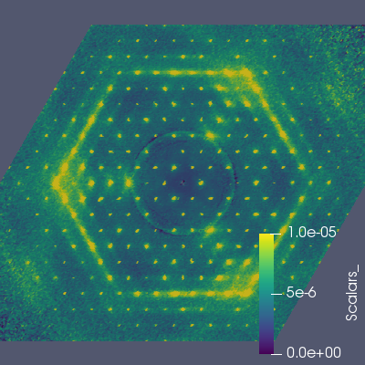

# Paraview

[ParaView](https://www.paraview.org)


## Slices

```python
#### import the simple module from the paraview
from paraview.simple import *

# create a new 'XML Structured Grid Reader'
benzilvts = XMLStructuredGridReader(FileName=['/SNS/users/rwp/corelli/docs/benzil.vts'])

# get active view
renderView1 = GetActiveViewOrCreate('RenderView')

# uncomment following to set a specific view size
renderView1.ViewSize = [400, 400]

# Properties modified on renderView1
renderView1.OrientationAxesVisibility = 0

# create a new 'Slice'
slice1 = Slice(Input=benzilvts)
slice1.SliceType.Normal = [0.0, 0.0, 1.0]

# get color transfer function/color map for 'Scalars_'
scalars_LUT = GetColorTransferFunction('Scalars_')

# show data in view
slice1Display = Show(slice1, renderView1)

# show color bar/color legend
slice1Display.SetScalarBarVisibility(renderView1, True)

# Rescale transfer function
scalars_LUT.RescaleTransferFunction(0.0, 1e-05)

# Apply a preset using its name. Note this may not work as expected when presets have duplicate names.
scalars_LUT.ApplyPreset('Viridis (matplotlib)', True)

# current camera placement for renderView1
renderView1.CameraPosition = [0.0, 0.0, 40]

#### uncomment the following to render all views
# RenderAllViews()
# alternatively, if you want to write images, you can use SaveScreenshot(...).

SaveScreenshot('benzil_hk0.png', quality=100, view=renderView1)
```


### HK1

```python
slice1.SliceType.Origin = [0.0, 0.0, 1.0]
SaveScreenshot('benzil_hk1.png', quality=100, view=renderView1)
```


### HK4

```python
slice1.SliceType.Origin = [0.0, 0.0, 4.0]
SaveScreenshot('benzil_hk4.png', quality=100, view=renderView1)
```




* * *
#### Previous: [Matplotlib](matplotlib) &nbsp;&nbsp;&nbsp;&nbsp;&nbsp;&nbsp; Next: [Benzil](benzil)
#### Up: [Index](index)
