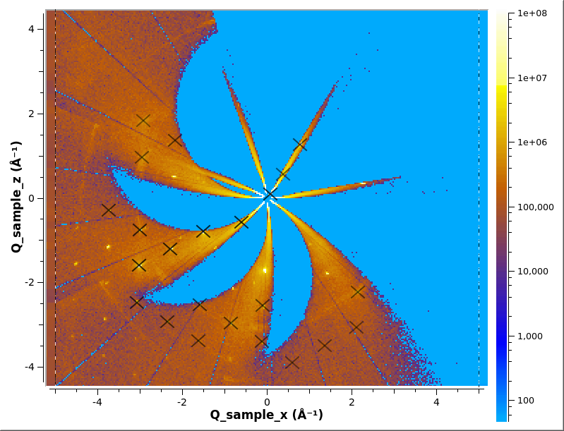

# Finding Peaks

You will need convert to the event workspace into a multi-dimensional
(MD) workspace in Q_sample units. See [Convert To MD/Q
Sample](md.md#q-sample).

## Finding Peaks

The peak in a MD workspace can be found using [FindPeaksMD](http://docs.mantidproject.org/nightly/algorithms/FindPeaksMD.html)

```python
FindPeaksMD(InputWorkspace='md',DensityThresholdFactor=50000, OutputWorkspace='peaks')
```

The output workspace `'peaks'` will be a [PeaksWorkspace](http://docs.mantidproject.org/nightly/concepts/PeaksWorkspace.html)

The peaks can be overlayed on the MD workspace in Slice Viewer
```python
sv=plotSlice('md',xydim=('Q_sample_x','Q_sample_z'),colormax=1e8,limits=[-5,5,-5,5],colorscalelog=True)
sv.setRebinMode(True)
sv.setRebinNumBins(300,300)
slicer = sv.getSlicer()
slicer.setPeaksWorkspaces(['peaks'])
sv.saveImage('md_peaks.png')
```



## Saving and Loading

The PeaksWorkspace can be saved using [SaveIsawPeaks](http://docs.mantidproject.org/nightly/algorithms/SaveIsawPeaks.html)
```python
SaveIsawPeaks(InputWorkspace='peaks',Filename='benzil.peaks')
```

They can loaded back into Mantid using [LoadIsawPeaks](http://docs.mantidproject.org/nightly/algorithms/LoadIsawPeaks.html)
```python
LoadIsawPeaks(Filename='benzil.peaks',OutputWorkspace='peaks')
```

