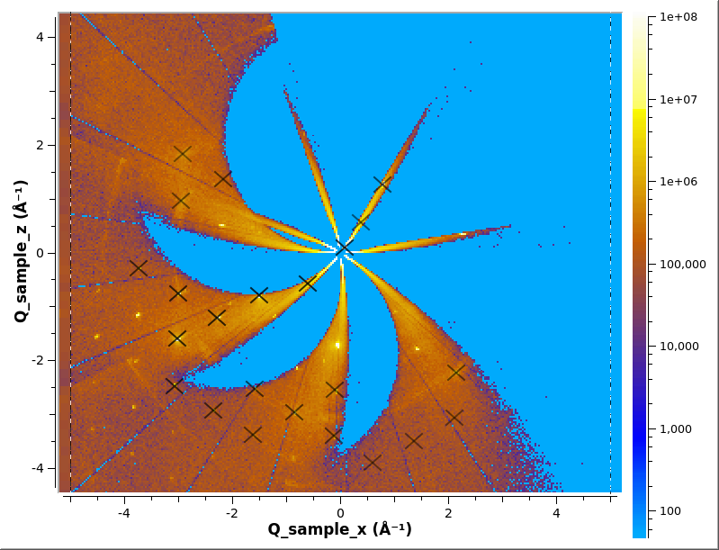

# Finding Peaks

* [Find peaks from MD workspace](#find-peaks-from-md-workspace)
* [Find peaks from TOF workspace](#find-peaks-from-tof-workspace)
* [Saving and Loading](#saving-and-loading)

## Find peaks from MD workspace

You will need convert to the event workspace into a multi-dimensional
(MD) workspace in Q_sample units. See [Convert To MD/Q
Sample](md#q-sample-1).

```python
ConvertMultipleRunsToSingleCrystalMD(Filename='CORELLI_29782:29817:10',
                                     SetGoniometer=True,
                                     Axis0="BL9:Mot:Sample:Axis1,0,1,0,1",
                                     MinValues='-10,-10,-10',
                                     MaxValues='10,10,10',
                                     OutputWorkspace='md')
```

The peaks in a MD workspace can be found using [FindPeaksMD]

```python
FindPeaksMD(InputWorkspace='md',
            DensityThresholdFactor=1000,
            PeakDistanceThreshold=0.5,
            OutputWorkspace='peaks')
```

The output workspace `'peaks'` will be a [PeaksWorkspace]

The peaks can be overlayed on the MD workspace in Slice Viewer
```python
sv=plotSlice('md',xydim=('Q_sample_x','Q_sample_z'),colormax=1e8,limits=[-5,5,-5,5],colorscalelog=True)
sv.setRebinMode(True)
sv.setRebinNumBins(300,300)
slicer = sv.getSlicer()
pp=slicer.setPeaksWorkspaces(['peaks'])
pp.getPeaksPresenter('peaks').setForegroundColor(QtGui.QColor(0, 0, 0, 255))
sv.saveImage('md_peaks.png')
```



## Find peaks from TOF workspace

You can find the peaks in a TOF workspace by using [FindSXPeaks]

## Saving and Loading

The PeaksWorkspace can be saved using [SaveIsawPeaks]
```python
SaveIsawPeaks(InputWorkspace='peaks',Filename='benzil.peaks')
```

They can loaded back into Mantid using [LoadIsawPeaks]
```python
LoadIsawPeaks(Filename='benzil.peaks',OutputWorkspace='peaks')
```

* * *
#### Previous: [Converting to MD](md) &nbsp;&nbsp;&nbsp;&nbsp;&nbsp;&nbsp; Next: [Finding the UB Matrix](ub)
#### Up: [Index](index)

[FindPeaksMD]: http://docs.mantidproject.org/nightly/algorithms/FindPeaksMD.html
[FindSXPeaks]: http://docs.mantidproject.org/nightly/algorithms/FindSXPeaks.html
[PeaksWorkspace]: http://docs.mantidproject.org/nightly/concepts/PeaksWorkspace.html
[SaveIsawPeaks]: http://docs.mantidproject.org/nightly/algorithms/SaveIsawPeaks.html
[LoadIsawPeaks]: http://docs.mantidproject.org/nightly/algorithms/LoadIsawPeaks.html