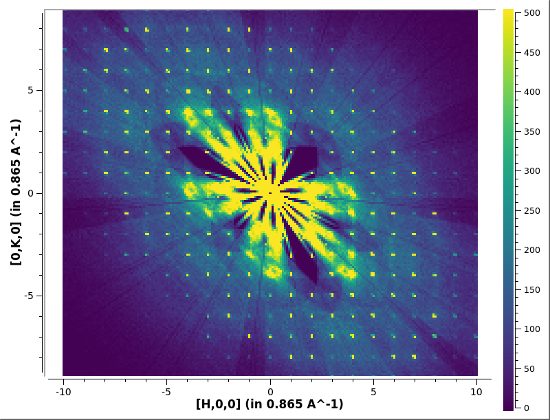
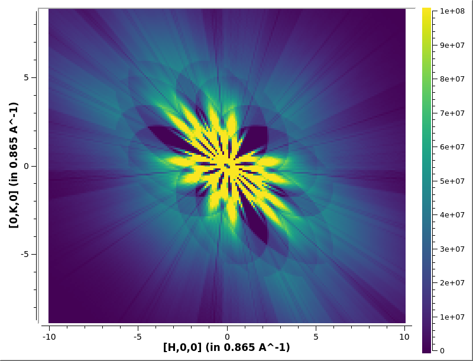
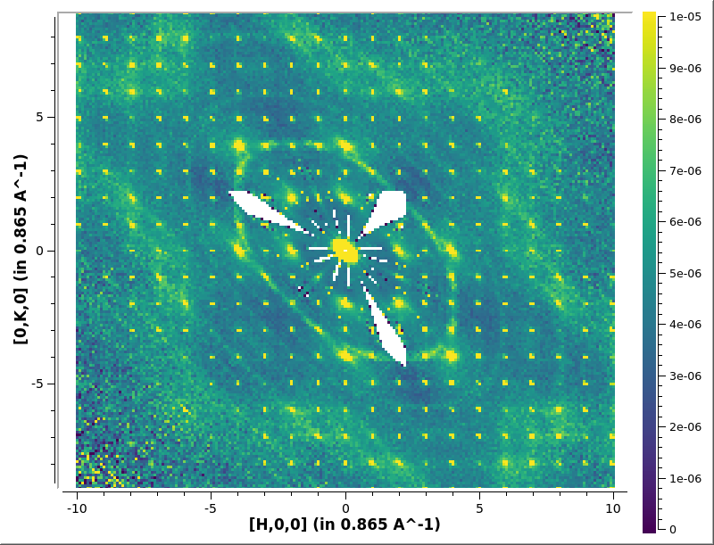

# Normalisation and symmetry

Once you have an UB matrix for your series of runs you can perform a
correctly normalised reduction of your data. You can read about
correct normalisation of data at [Multi dimensional neutron scattering
data normalization][MDNorm].

You may require additional masking, the mask is copied from the
SolidAngle workspace but it may have changed. See [Masking](mask).

The only other thing requires is the SolidAngle and Flux workspaces
which should be provided by the instrument scientist but an example is
shown at [Creating Solid Angle and Flux workpace](van).

[SingleCrystalDiffuseReduction] makes use of [MDNormSCD]

```python
SingleCrystalDiffuseReduction(Filename='CORELLI_29782:29817:10',
                              SolidAngle='/SNS/CORELLI/shared/Vanadium/2016B/SolidAngle20160720NoCC.nxs',
                              Flux='/SNS/CORELLI/shared/Vanadium/2016B/Spectrum20160720NoCC.nxs',
                              UBMatrix="/SNS/CORELLI/IPTS-15526/shared/benzil_Hexagonal.mat",
			      KeepTemporaryWorkspaces=True,
                              OutputWorkspace='output',
                              SetGoniometer=True,
                              Axis0="BL9:Mot:Sample:Axis1,0,1,0,1",
                              BinningDim0='-10.05,10.05,201',
                              BinningDim1='-10.05,10.05,201',
                              BinningDim2='-0.1,0.1,1',
                              SymmetryOps="P 31 2 1")
```

If you have a look at the un-normalized data you will see the
overlapping of the data.

```python
sv=plotSlice('output_data',colormax=5e2,limits=[-10,10,-10,10])
sv.saveImage('output_data.png')
```



If you have a look at the normalization workspace you will see how the
is correctly normalized for the overlapping data.

```python
sv=plotSlice('output_normalization',colormax=1e8,limits=[-10,10,-10,10])
sv.saveImage('output_normalization.png')
```



The correctly normalized output is the data divided by the
normalization.

```
sv=plotSlice('output',colormax=1e-5,limits=[-10,10,-10,10])
sv.saveImage('output.png')
```



* * *
#### Previous: [Finding the UB Matrix](ub) &nbsp;&nbsp;&nbsp;&nbsp;&nbsp;&nbsp; Next: [Exporting Data](export)
#### Up: [Index](index)

[MDNorm]: http://docs.mantidproject.org/nightly/concepts/MDNorm.html
[SingleCrystalDiffuseReduction]: http://docs.mantidproject.org/nightly/algorithms/SingleCrystalDiffuseReduction.html
[MDNormSCD]: http://docs.mantidproject.org/nightly/algorithms/MDNormSCD.html
[SaveMD]: http://docs.mantidproject.org/nightly/algorithms/SaveMD.html
