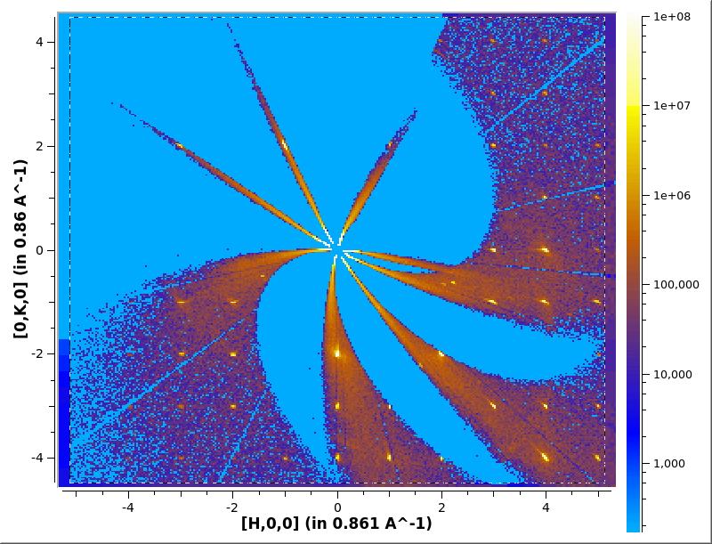

# Finding UB matrix

Using the peaks workspace from [Finding Peaks](peaks.md) using either
* [FindUBUsingFFT](http://docs.mantidproject.org/nightly/algorithms/FindUBUsingFFT.html)
* [FindUBUsingLatticeParameters](http://docs.mantidproject.org/nightly/algorithms/FindUBUsingLatticeParameters.html)

```python
FindUBUsingFFT(PeaksWorkspace='peaks', MinD=5, MaxD=15)
```
Output:
```
FindUBUsingFFT-[Notice] UB = Matrix(3,3)-0.116094,-0.00487335,-0.00105331,0.00529429,-0.00455602,-0.0714388,0.0726219,-0.136753,0.00278309
FindUBUsingFFT-[Notice] New UB will index 350 Peaks out of 640 with tolerance of  0.15
FindUBUsingFFT-[Notice] Lattice Parameters:    8.428795    8.436472   13.987253   89.489977   89.461538   59.967536   861.039268
FindUBUsingFFT-[Notice] Parameter Errors  :    0.003963    0.004302    0.013582    0.062830    0.061831    0.034438    1.070184
```

Show possible cells using [ShowPossibleCells](http://docs.mantidproject.org/nightly/algorithms/ShowPossibleCells.html)

```python
ShowPossibleCells(PeaksWorkspace='peaks')
```
Output:
```
ShowPossibleCells-[Notice] Num Cells : 5
ShowPossibleCells-[Notice] Form #12  Error: 0.0677  Hexagonal     P   Lat Par:   8.4288   8.4365  13.9873    89.490   90.538  120.032     861.04
ShowPossibleCells-[Notice] Form #13  Error: 0.0677  Orthorhombic  C   Lat Par:   8.4285  14.6081  13.9873    89.395   90.028   89.940    1722.08
ShowPossibleCells-[Notice] Form #10  Error: 0.0077  Monoclinic    C   Lat Par:  14.6081   8.4285  13.9873    89.972   90.605   89.940    1722.08
ShowPossibleCells-[Notice] Form #34  Error: 0.0677  Monoclinic    P   Lat Par:   8.4288  13.9873   8.4365    89.490  120.032   90.538     861.04
ShowPossibleCells-[Notice] Form #31  Error: 0.0000  Triclinic     P   Lat Par:   8.4288   8.4365  13.9873    89.490   89.462   59.968     861.04
```

Select the cell using either
* [SelectCellOfType](http://docs.mantidproject.org/nightly/algorithms/SelectCellOfType.html)
* [SelectCellWithForm](http://docs.mantidproject.org/nightly/algorithms/SelectCellWithForm.html)

```python
SelectCellOfType(PeaksWorkspace='peaks',CellType='Hexagonal',Apply=True)
```
Output
```
SelectCellOfType-[Notice] Form #12  Error: 0.0677  Hexagonal     P   Lat Par:   8.4288   8.4365  13.9873    89.490   90.538  120.032     861.04
SelectCellOfType-[Notice] Transformation Matrix =  0.955632 -0.0313033 -0.0686434 -0.0891775 -0.998573 0.00313016 -1.22336 0.0195821 -0.957059
SelectCellOfType-[Notice] Re-indexed the peaks with the new UB.
SelectCellOfType-[Notice] Now, 319 are indexed with average error 0.0253924
```

## Saving and Loading

Once you have the desired UB save it with [SaveIsawUB](http://docs.mantidproject.org/nightly/algorithms/SaveIsawUB.html)

```python
SaveIsawUB(InputWorkspace='peaks', Filename='benzil.mat')
```

```
$ cat benzil.mat
 0.07262451 -0.11609529  0.00529399
 0.13675388  0.00487304  0.00455592
-0.00276429  0.00104644  0.07143654
     8.4288      8.4365     13.9873     89.4900     90.5385    120.0325    861.0393
     0.0034      0.0037      0.0118      0.0545      0.0537      0.0293      0.8884


The above matrix is the Transpose of the UB Matrix. The UB matrix maps the column
vector (h,k,l ) to the column vector (q'x,q'y,q'z).
|Q'|=1/dspacing and its coordinates are a right-hand coordinate system where
 x is the beam direction and z is vertically upward.(IPNS convention
```

You can load the UB onto a workspace using [LoadIsawUB](http://docs.mantidproject.org/nightly/algorithms/LoadIsawUB.html)

```python
LoadIsawUB(InputWorkspace='ws', Filename='benzil.mat')
```

## Verifying UB Matrix

You can check the UB matrix by re-running [Convert to HKL
MD](md.md#hkl) with the found UB matrix which will create a MD
workspace in HKL coordinates. The peaks should now align on HKL
integers.

```python
ConvertMultipleRunsToSingleCrystalMD(Filename='CORELLI_29782:29817:10',
                                     FilterByTofMin=1000,
                                     FilterByTofMax=16666,
                                     SetGoniometer=True,
                                     Axis0="BL9:Mot:Sample:Axis1,0,1,0,1",
				     UBMatrix='benzil.mat',
                                     OutputWorkspace='hkl')

# Plot in Slice Viewer
sv=plotSlice('hkl',colormax=1e8,limits=[-5,5,-5,5],colorscalelog=True)
sv.setRebinMode(True)
sv.setRebinNumBins(300,300)
sv.saveImage('hkl.png')
```


