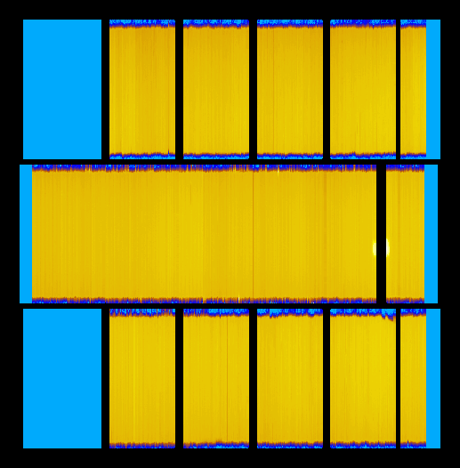
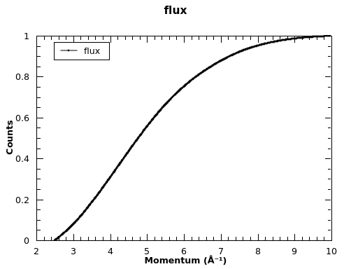

# Create solid angle and flux workspaces for normalisation

The reduced vanadium solid angle and flux should be provided by the
instrument scientist for your particular sample environment. This is
just an exmaple of how they are created.

There is an example of creating the SolidAngle and Flux workspaces in
the
[MDNormSCD](http://docs.mantidproject.org/nightly/algorithms/MDNormSCD.html)
usage examples
[here](http://docs.mantidproject.org/nightly/algorithms/MDNormSCD-v1.html#usage)

```python
# Vanadium for normalisation
Load(Filename='CORELLI_28119-28123', OutputWorkspace='van')
ConvertUnits(InputWorkspace='van', OutputWorkspace='van', Target='Momentum')
CropWorkspace(InputWorkspace='van', OutputWorkspace='van', XMin='2.5', XMax='10')

# Get Solid Angle
Rebin(InputWorkspace='van', OutputWorkspace='sa', Params='2.5,10,10', PreserveEvents='0')
SaveNexus(InputWorkspace='sa', Filename='SolidAngle.nxs')

# Get Flux
SumSpectra(InputWorkspace='van', OutputWorkspace='flux')
CompressEvents(InputWorkspace='flux', OutputWorkspace='flux')
Rebin(InputWorkspace='flux', OutputWorkspace='flux', Params='2.5,10,10')
flux=mtd['flux']
for i in range(flux.getNumberHistograms()):
    el=flux.getSpectrum(i)
    el.divide(flux.readY(i)[0],0)
Rebin(InputWorkspace='flux', OutputWorkspace='flux', Params='2.5,10,10')
IntegrateFlux(InputWorkspace='flux', OutputWorkspace='flux')
SaveNexus(InputWorkspace='flux', Filename='Spectrum.nxs')
```

### Plot the Solid Angle instrument view
```python
iv=getInstrumentView('sa')
render = iv.getTab(InstrumentWidget.RENDER)
render.setScaleType(GraphOptions.Log10)
render.saveImage('sa.png')
```



### Plot the flux workspace
```python
p=plotSpectrum('flux',0)
p.exportImage('flux.png',50)
```



* * *
#### Previous: [Normalisation and symmetry](reduction) &nbsp;&nbsp;&nbsp;&nbsp;&nbsp;&nbsp; Next: [Benzil](benzil)
#### Up: [Index](index)
